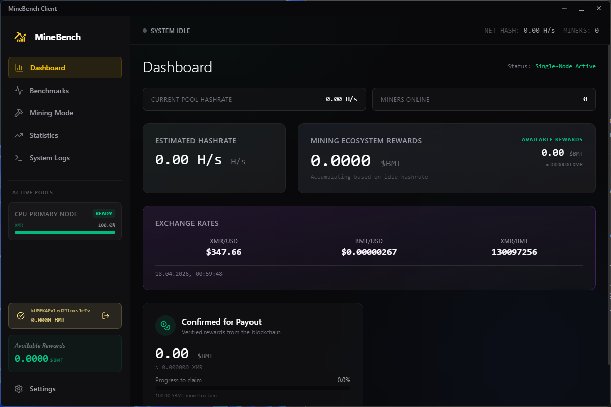

[](https://minebench.cloud/downloads)

# MineBench Client
> Open-source mining benchmark client built with Electron. Measure CPU & GPU performance, optimize hashrate, and earn crypto rewards on Solana.


  
[](https://minebench.cloud/)
>MineBench is a crypto mining benchmark tool that allows users to test hardware performance, compare results, and earn blockchain-based rewards.

MineBench is a **crypto mining benchmark tool** designed to test CPU and GPU performance.

This **mining benchmark client** allows users to measure hashrate, optimize mining efficiency, and earn crypto rewards.


## Features

- ⚡ CPU & GPU benchmarking
- ⛏️ Integrated crypto mining support
- 🧠 Real-time hashrate & performance metrics
- 💰 Earn rewards on Solana blockchain
- 🖥️ Cross-platform (Windows & Linux)
- 🔐 Secure and lightweight Electron app


Unlike traditional benchmarks, MineBench provides:

- Real mining-based performance metrics
- Blockchain-verified results
- Crypto rewards for benchmarking

## Mining mode
[](https://minebench.cloud/downloads)

In mining mode you can connect to MineBench own Monero mining pool and increase total hashrate of our pool.
Rewards will be converted to [$BMT token](https://pump.fun/coin/67ipDsgK6D7bqTW89H8T1KTxUvVuaFy92GX7Q2XFVdev)
- 20% of rewards will be distributed to support our app
- 80% of rewards will be distributed to active community members who run mining mode minimum 15 minutes.
  
Rewards will be distributed in equivalent parts to each active tester in [$BMT token](https://pump.fun/coin/67ipDsgK6D7bqTW89H8T1KTxUvVuaFy92GX7Q2XFVdev).

Join our testers community you can inside [Discord channel - MineBench](https://discord.gg/vsDyYh4rma)

## Benchmark mode
[](https://minebench.cloud/downloads)

Our benchmark mode is the main feature of application. This application is built with goal to monetize benchmarks.
Each benchmark matter. Instead of burning compute power each user who run the benchmark supported Monero blockchain network
our mining pool receiving rewards and we will distribute 20% of rewards to each user who ran the benchmark.

In current period of time we looking for ways to implement automatica rewards feature. This feature of automatic rewards
not working yet. But if you run the benchmark you support our application and help us earn money to build this functionality.

## Cards with mining pool stats

[](https://minebench.cloud/downloads)

In real time each our miner can look at current total hashrate of our mining pool. You can see how many miners online. That current hashrate of pool.
Also includes information about finded blocks.

## $BMT utility token
Token listed on pumpfun - [buy $BMT token to support app development](https://pump.fun/coin/67ipDsgK6D7bqTW89H8T1KTxUvVuaFy92GX7Q2XFVdev)

$BMT token is a utility token. We will convert earned from mining Monero tokens to our token. And will distribute 80% of rewards in $BMT token to each user who participated in seeking the block.
Our token is backed by Monero mining.

## Architectural role

The client is the trust boundary closest to the user machine. It is responsible
for gathering device-level signals, launching local mining workflows, and
presenting benchmark and reward state without embedding backend-only authority.

That split matters:

- the desktop runtime may observe and submit state
- it must not own backend accounting or treasury logic
- any privileged infrastructure access has to remain server-side

## Technology stack

- Electron
- React
- TypeScript
- Vite

## Use Cases

- Benchmark your mining hardware
- Compare GPU and CPU performance
- Optimize mining efficiency
- Earn crypto rewards via benchmarking

## Development & contribution

MineBench Client is the desktop execution layer of the MineBench ecosystem. It
combines the benchmark runtime, miner orchestration, wallet-aware reward
surfaces, and device-local state needed to turn a user workstation into an
auditable mining edge node.

This repository is where user hardware, miner binaries, wallet UX, and product
controls meet. As a result, it has to balance operator-grade reliability with a
consumer-facing user experience.


## What this module owns

- hardware benchmarking and local capability detection
- miner process lifecycle management
- desktop wallet and rewards UX
- device-local telemetry and settings persistence
- multi-platform packaging for Windows, macOS, and Linux

Install dependencies:

```bash
npm install
```

Run the integrated desktop development flow:

```bash
npm run dev:all
```

## Builds

```bash
npm run dist:win
npm run dist:mac
npm run dist:linux
```


# Security & Transparency

This project is fully open-source.

⚠️ Note: Mining software may be flagged as false-positive by antivirus tools.

- No hidden processes
- No background mining without user consent

## License


## Download
[](https://minebench.cloud/downloads)

## Support 
[](https://pump.fun/coin/67ipDsgK6D7bqTW89H8T1KTxUvVuaFy92GX7Q2XFVdev)
